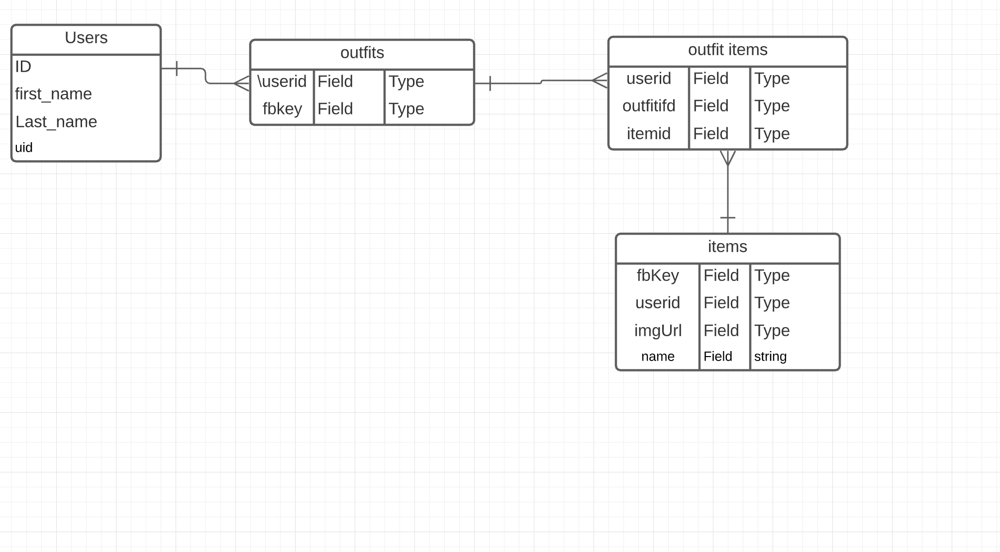

# No Stylist- Front End Capstone 

## User Story 
When logged in to no stylist users should be able to create outfits and user prior garments as pieces to add to their outfits.

## Goals
Generate user posts that can double as a outfit and not allowing users to post anything other than that. 

- Creating a user feed that allows users to search through ‘Mannaquein cards that double as outfits. 
- Create a search feed that allows users to search already uploaded pics to be able to add to their own cards. 

- Users should be able to make a outfit card that consist of  2,3,4, or 5 different garments (shoes,shirt,pants,hat, accesories ) 
- Users should see a gallery of every garment ever posted on the platform to be able to use those pieces in their own cards. 
- Users should be able to boost post to the top of their page. 
- Users should be able to see feed of all global cards made . 
- Users should be able to have private outfits and global outfits. 
- Home/Feed with all cards ever made 
- Gallery every garment ever uploaded to site 
-Profile with all made outfits. Private and public. 

- The ability to boost post to the top of page(stretch goal ) 

## ERD 

## Wireframe
[Link](https://www.figma.com/file/Xdd1mNlNiRpkBtxCiL6gKR/No-stylist?node-id=0%3A1)